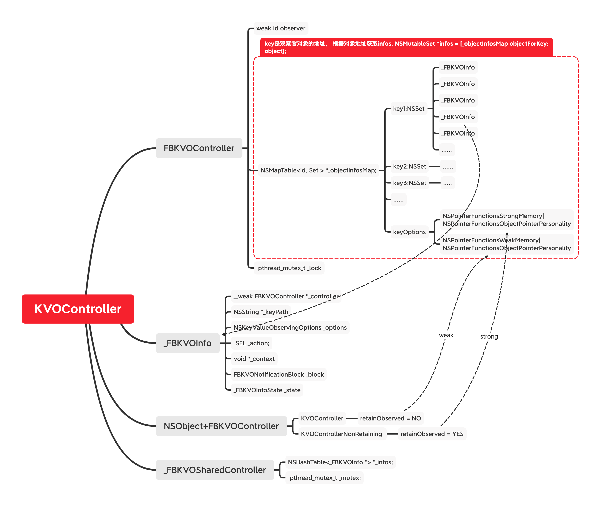
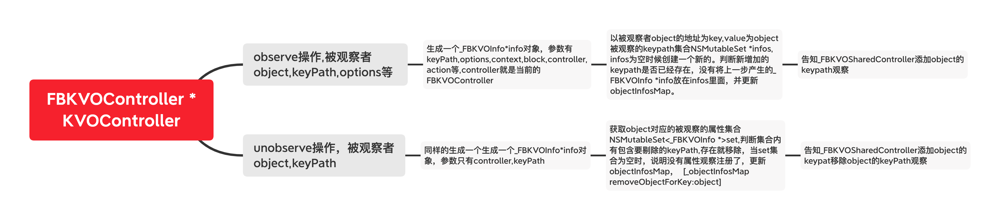
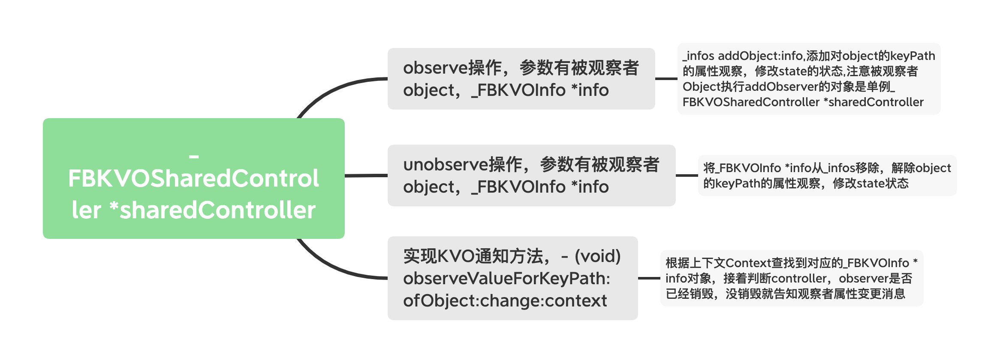

## FBKVOController 源码


### FBKVOController

#### 优点

* 避免了重复添加，重复移除不匹配问题
* 支持了Block,SEL，编写代码更方便快捷
* 观察者提前释放，导致闪退的问题

#### 缺点

*  需要在项目中做规范要求，不然会存在KVO和FBKVOController两种方式
*  带来了多余的内存消耗，NSMapTable*objectInfosMap，_FBKVOSharedController *sharedController,这些消耗是可以接受的，总比上线闪退了好，当然也可以Hook系统的方法解决闪退问题。


### 结构

* NSObject+FBKVOController
* _FBKVOInfo
*  FBKVOController
* _FBKVOSharedController



### 逻辑示意图





### NSObject+FBKVOController


1.  这是一个NSObject的分类，只要是继承自NSObject的对象都可以使用。
2. 调用`self.KVOController`或者`self.KVOControllerNonRetaining`会生成一个`FBKVOController`实例对象，实例对象的区别在于`FBKVOController`内部的`NSMapTable*objectInfosMap`在初始化时`keyOptions`的不同。为YES时候代办内部会持有对象，相当于Strong，为NO时候，相当于Weak修饰。
3. 将第2部生成的`self.KVOController`对象，通过关联操作保存起来。

```
@property (nonatomic, strong) FBKVOController *KVOController;
@property (nonatomic, strong) FBKVOController *KVOControllerNonRetaining;
```

```
  FBKVOController * controller = [FBKVOController controllerWithObserver:self retainObserved:YES/NO];
  objc_setAssociatedObject(self, Key, KVOController, OBJC_ASSOCIATION_RETAIN_NONATOMIC);
```


## _FBKVOInfo


将`FBKVOController *KVOController`调用`observe`方法的的参数包装起来，其中包括以下几点：<br>

*  __weak FBKVOController *_controller;
*  _keyPath
*  _options
*  _FBKVOInfoState _state ，默认为_FBKVOInfoStateInitial，当处于观察中时 state = _FBKVOInfoStateObserving,解除观察者时 state = _FBKVOInfoStateNotObserving
*  _block,_action, void *_context，要么全为空，要么只有其中一个有值。


```
@interface _FBKVOInfo : NSObject
{
@public
  __weak FBKVOController *_controller;
  NSString *_keyPath;
  NSKeyValueObservingOptions _options;
  SEL _action;
  void *_context;
  FBKVONotificationBlock _block;
  _FBKVOInfoState _state;
}
```
@end

### _FBKVOInfo 初始化


```
- (instancetype)initWithController:(FBKVOController *)controller
                           keyPath:(NSString *)keyPath
                           options:(NSKeyValueObservingOptions)options
                             block:(nullable FBKVONotificationBlock)block
                            action:(nullable SEL)action
                           context:(nullable void *)context
{
  self = [super init];
  if (nil != self) {
    _controller = controller;
    _block = [block copy];
    _keyPath = [keyPath copy];
    _options = options;
    _action = action;
    _context = context;
  }
  return self;
}
```

### 判断两个_FBKVOInfo是否相等，重写`hash`,`isEqual:(id)object`方法


```
- (NSUInteger)hash
{
  return [_keyPath hash];
}

- (BOOL)isEqual:(id)object
{
  if (nil == object) {
    return NO;
  }
  if (self == object) {
    return YES;
  }
  if (![object isKindOfClass:[self class]]) {
    return NO;
  }
  return [_keyPath isEqualToString:((_FBKVOInfo *)object)->_keyPath];
}
```


### FBKVOController

### Class结构


```
  //观察者，有时也可以是FBKVOController *object的持有者，因为是weak不会导致强引用问题。
    __weak id observer; 
  //key是被观察者的地址，value是多个_FBKVOInfo的集合，其中_FBKVOInfo中重写了isEqual方法。
    NSMapTable<id, NSMutableSet<_FBKVOInfo *> *> *_objectInfosMap;
    //互斥锁，用于多线程读写竞争问题
   pthread_mutex_t _lock;
```
### 初始化


* _observer赋值
* _objectInfosMap初始化，根据retainObserved的值，决策是否在存储时是Strong，还是weak操作。
* pthread_mutex_t _lock初始化


```
- (instancetype)initWithObserver:(nullable id)observer retainObserved:(BOOL)retainObserved
{
    _observer = observer;
    NSPointerFunctionsOptions keyOptions = retainObserved ? NSPointerFunctionsStrongMemory|NSPointerFunctionsObjectPointerPersonality : NSPointerFunctionsWeakMemory|NSPointerFunctionsObjectPointerPersonality;
    _objectInfosMap = [[NSMapTable alloc] initWithKeyOptions:keyOptions valueOptions:NSPointerFunctionsStrongMemory|NSPointerFunctionsObjectPersonality capacity:0];
    pthread_mutex_init(&_lock, NULL);
}
```


###  方法调用

   

   * 参数校验,不合法就返回,接着将参数包装成一个 ` _FBKVOInfo *info`实例对象，将生成的`_FBKVOInfo *info` 传递给第二步。
   

```
- (void)observe:(nullable id)object keyPath:(NSString *)keyPath options:(NSKeyValueObservingOptions)options block:(FBKVONotificationBlock)block
{  
  if (nil == object || 0 == keyPath.length || NULL == block) return;
  _FBKVOInfo *info = [[_FBKVOInfo alloc] initWithController:self keyPath:keyPath options:options block:block];
  [self _observe:object info:info];
}
```


*  先判断对象object是否被注册过，如果注册过 `NSMutableSet *infos = [_objectInfosMap objectForKey:object];` 将不会空，没被注册过将创建一个新的，并存储到`_objectInfosMap`中。其中key为object的内存地址
*  判断新添加的keyPath是否已经存在，直接返回，避免重复添加。【这一步比较关键】
*  将Object和info传递给单例对象 `_FBKVOSharedController`

```
- (void)_observe:(id)object info:(_FBKVOInfo *)info
{
  // lock
  pthread_mutex_lock(&_lock);

  //以被观察者object的地址为key,查找对应的NSMutableSet *infos，infos不为空，说明之前执行过_observe方法
  NSMutableSet *infos = [_objectInfosMap objectForKey:object];

  //判断info是否已经保存过，[infos member:info]，如果info被存储过，将返回info，不存在将返回nil
  // 作用是判断当前持有KVOController的对象，不会多次添加object的属性观察
  _FBKVOInfo *existingInfo = [infos member:info];
  if (nil != existingInfo) {
    // observation info already exists; do not observe it again

    // unlock and return
    pthread_mutex_unlock(&_lock);
    return;
  }

  // 没有注册过object,将object为key，infos为value放到里面
  if (nil == infos) {
    infos = [NSMutableSet set];
    [_objectInfosMap setObject:infos forKey:object];
  }

  // 将新注册的info放到NSMutableSet infos中去
  [infos addObject:info];

  // unlock prior to callout
  pthread_mutex_unlock(&_lock);

  //将注册的object info信息传递给 _FBKVOSharedController
  [[_FBKVOSharedController sharedController] observe:object info:info];
}
```


*  解除object中单个属性keyPath的观察
*  首先判断object是否添加过属性观察
*  然后判断要剔除的keyPath是否存在，存在就将keyPath从infos中解除，解除之后的infos为空，说明object已经没了属性观察，_objectInfosMap移除object对应的info.
*  将数据传递给单例对象`_FBKVOSharedController`

```
- (void)_unobserve:(id)object info:(_FBKVOInfo *)info
{
  // lock
  pthread_mutex_lock(&_lock);

  // 获取object对应的_FBKVOInfos集合，infos为空说明之前没有添加过object属性观察
  NSMutableSet *infos = [_objectInfosMap objectForKey:object];

  // 判断infos集合中keyPath是否被添加过，添加过返回registeredInfo
  _FBKVOInfo *registeredInfo = [infos member:info];

  if (nil != registeredInfo) {
    //将keyPath解除
    [infos removeObject:registeredInfo];

    // remove no longer used infos
    if (0 == infos.count) {
      //没有观察的属性了，将object对应的集合移除
      [_objectInfosMap removeObjectForKey:object];
    }
  }

  // unlock
  pthread_mutex_unlock(&_lock);

  // unobserve
  [[_FBKVOSharedController sharedController] unobserve:object info:registeredInfo];
}

```

## _FBKVOSharedController

*  单例设计模式
* 实现了KVO相关的方法
* 向外提供了属性监听和移除方法，收到被观察者的属性变更方法通知观察者。
* 线程安全


### 类结构

```
{
  NSHashTable<_FBKVOInfo *> *_infos;
  pthread_mutex_t _mutex;
}
```


```
- (instancetype)init
{
    //这里会根据不同的平台去初始化NSHashTable *infos 
    NSHashTable *infos = [[NSHashTable alloc] initWithOptions:];
    pthread_mutex_init(&_mutex, NULL);

  return self;
}
```
### 核心方法

* 将注册监听的info的存储到_infos集合中
* 添加对obejct的属性keypath的监听，并将info当做context传递回去，会在收到属性改变时候用到。
* 改变info->_state的状态，为_FBKVOInfoStateNotObserving时直接移除观察者监听


```
- (void)observe:(id)object info:(nullable _FBKVOInfo *)info
{
  if (nil == info) {
    return;
  }
  // register info
  pthread_mutex_lock(&_mutex);
  [_infos addObject:info];
  pthread_mutex_unlock(&_mutex);

  // 单例对象_FBKVOSharedController添加对object的属性keyPath的观察,这里我们将info传递到context中了
  [object addObserver:self forKeyPath:info->_keyPath options:info->_options context:(void *)info];
  // info->_state 状态修改
  if (info->_state == _FBKVOInfoStateInitial) {
    info->_state = _FBKVOInfoStateObserving;
  } else if (info->_state == _FBKVOInfoStateNotObserving) {
   //如果状态是不在观察中，就直接移除观察者
    [object removeObserver:self forKeyPath:info->_keyPath context:(void *)info];
  }
}
```
 
 
 
 * 根据info，将对应的属性观察者剔除，并改变info->_state的状态为_FBKVOInfoStateNotObserving
 
 ```
 - (void)unobserve:(id)object info:(nullable _FBKVOInfo *)info
{
  if (nil == info) {
    return;
  }
  // unregister info
  pthread_mutex_lock(&_mutex);
  [_infos removeObject:info];
  pthread_mutex_unlock(&_mutex);

  // 移除观察者
  if (info->_state == _FBKVOInfoStateObserving) {
    [object removeObserver:self forKeyPath:info->_keyPath context:(void *)info];
  }
  info->_state = _FBKVOInfoStateNotObserving;
}
 ```
 
 
 * 被观察对象的属性发生改变，通知观察者单例对象_FBKVOSharedController
 * 根据context上下文拿到注册时候传入的_FBKVOInfo *info，这里需要注意官方文档说有个strong 操作
 * 根据_FBKVOInfo *info中的信息，拿到controller，observer等信息
 * 执行block，Sel，或者告知观察者observer，属性信息发生改变了，这里需要注意观察者observer可以直接实现 `observeValueForKeyPath:ofObject:change:context`,与没使用FBKVOController的区别是变更消息由_FBKVOSharedController接受，再传递给观察者。


```
- (void)observeValueForKeyPath:(nullable NSString *)keyPath
                      ofObject:(nullable id)object
                        change:(nullable NSDictionary<NSKeyValueChangeKey, id> *)change
                       context:(nullable void *)context
{
  NSAssert(context, @"missing context keyPath:%@ object:%@ change:%@", keyPath, object, change);

  _FBKVOInfo *info;

  {
    // lookup context in registered infos, taking out a strong reference only if it exists
    pthread_mutex_lock(&_mutex);
    info = [_infos member:(__bridge id)context];
    pthread_mutex_unlock(&_mutex);
  }

  if (nil != info) {

    // take strong reference to controller
    FBKVOController *controller = info->_controller;
    if (nil != controller) {

      // take strong reference to observer
      id observer = controller.observer;
      if (nil != observer) {

        // dispatch custom block or action, fall back to default action
        if (info->_block) {
          NSDictionary<NSKeyValueChangeKey, id> *changeWithKeyPath = change;
          // add the keyPath to the change dictionary for clarity when mulitple keyPaths are being observed
          if (keyPath) {
            NSMutableDictionary<NSString *, id> *mChange = [NSMutableDictionary dictionaryWithObject:keyPath forKey:FBKVONotificationKeyPathKey];
            [mChange addEntriesFromDictionary:change];
            changeWithKeyPath = [mChange copy];
          }
          info->_block(observer, object, changeWithKeyPath);
        } else if (info->_action) {
#pragma clang diagnostic push
#pragma clang diagnostic ignored "-Warc-performSelector-leaks"
          [observer performSelector:info->_action withObject:change withObject:object];
#pragma clang diagnostic pop
        } else {
          [observer observeValueForKeyPath:keyPath ofObject:object change:change context:info->_context];
        }
      }
    }
  }
}
```


### github链接

https://github.com/facebookarchive/KVOController