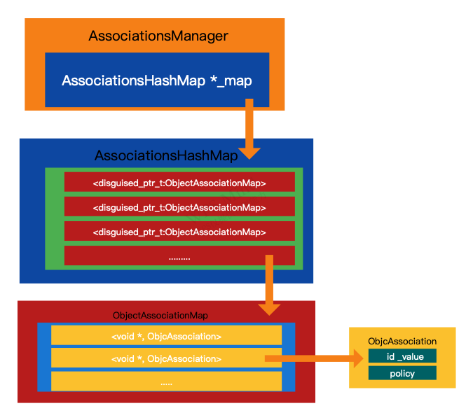

# 关联对象原理


### 从问题出发

* 利用关联对象实现一个weak功能，除了壳对象，还有其他方式吗
* 关联对象的内部结构是什么，能够讲一下内部实现，当对象销毁的时候，关联对象如何移除的。
* 关联对象的使用场景，？你项目中有哪些地方用到，需要注意什么？？有哪些副作用。
* 类对象和meta对象能添加关联对象吗，有什么问题？？


### 定义

**Associative References**

`Associative `意思为关联，能够将两个对象建立一种关系。这种关系是一种`从属`关系，也就是说有一个`关联者`和一个`被关联者`。比如说我们可以将一个`NSString `对象关联到一个`UIView`对象上。这里的`NSString `对象就是 `被关联者`, `UIView` 对象就是 `关联者`。[[参阅]](http://www.enkichen.com/2017/02/18/ios-associative/)


### API


属性修饰符【需要注意关联对象的使用是`对象`,`基本类型`需要转换为NSNumber,NSString等对象】

```
typedef OBJC_ENUM(uintptr_t, objc_AssociationPolicy) {
    OBJC_ASSOCIATION_ASSIGN = 0,           /** weak                   */
    OBJC_ASSOCIATION_RETAIN_NONATOMIC = 1, /** strong.   no atomically*/
    OBJC_ASSOCIATION_COPY_NONATOMIC = 3,   /**< copied   no atomically */
    OBJC_ASSOCIATION_RETAIN = 01401,       /**< strong   atomically */
    OBJC_ASSOCIATION_COPY = 01403          /**< copied   atomically */
};
```


```
void objc_setAssociatedObject(id _Nonnull object, const void * _Nonnull key,
                         id _Nullable value, objc_AssociationPolicy policy);
```
```
id _Nullable objc_getAssociatedObject(id _Nonnull object, const void * _Nonnull key);
```
```
void objc_removeAssociatedObjects(id _Nonnull object);
```

### 如何使用 

* 实例对象
* 类对象
* 元类对象


#### 实例对象

```
NSObject *instanceValue  = [[NSObject alloc] init];
YUObject *object           = [[YUObject alloc] init];
char *instancekey1         = "instanceKey1";
char *instancekey2         = "instanceKey2";
//添加操作
objc_setAssociatedObject(object, instancekey1,instanceValue, OBJC_ASSOCIATION_RETAIN);
NSObject *getInstanceValue1 = objc_getAssociatedObject(object,instancekey1);
NSLog(@"打印实例对象%@",getInstanceValue1);

objc_setAssociatedObject(object, instancekey2,instanceValue, OBJC_ASSOCIATION_RETAIN);
NSObject *getInstanceValue2 = objc_getAssociatedObject(object,instancekey2);
NSLog(@"打印实例对象%@",getInstanceValue2);


//移除instancekey相关的关联对象
//setAssociatedObject操作，value为空时候移除
objc_setAssociatedObject(object, instancekey1,nil, OBJC_ASSOCIATION_RETAIN);
NSObject *getInstanceValue3 = objc_getAssociatedObject(object,instancekey1);
NSLog(@"打印实例对象%@",getInstanceValue3);

//移除全部
objc_removeAssociatedObjects(object);
```

####  类对象

```
YUObject *object       = [[YUObject alloc] init];
NSObject *classValue   = [[NSObject alloc] init];
Class classObject      = object_getClass(object);
char *classkey         = "classkey";
objc_setAssociatedObject(classObject,classkey,classValue, OBJC_ASSOCIATION_RETAIN);
NSObject *getClassValue = objc_getAssociatedObject(classObject, classkey);
NSLog(@"打印类对象%@",getClassValue);

```

#### 元类对象

```
YUObject *object       = [[YUObject alloc] init];
Class classObject      = object_getClass(object);
Class classMetaObject      = object_getClass(classObject);
char *classMetakey         = "classMetakey";
NSObject *classMetaValue   = [[NSObject alloc] init];
objc_setAssociatedObject(classMetaObject,classMetakey,classMetaValue, OBJC_ASSOCIATION_RETAIN);
NSObject *getMetaClassValue = objc_getAssociatedObject(classObject, classkey);
NSLog(@"打印元类对象%@",getMetaClassValue);
```


### 实现原理

在 [objc4](https://github.com/opensource-apple/objc4)源码中我们可以找到具体的实现方式。<br>

#### 从结构图开始

**快速记忆：字典里面嵌套字典**



### 了解结构

* AssociationsManager
* AssociationsHashMap
* ObjectAssociationMap
* ObjcAssociation


####  AssociationsManager


作用：管理一个全局`static AssociationsHashMap *_map;`<br>


这里需要注意` AssociationsHashMap *_map`的修饰符是`static`。在C++中，**类中的静态变量**声明为`static`的变量只被初始化一次，因为它们在单独的静态存储中分配了空间，因此类中的静态变量由对象共享,可以减少对象的大小。[C++中的解释static](https://zhuanlan.zhihu.com/p/152046509)

```C++
spinlock_t AssociationsManagerLock;
class AssociationsManager {
    static AssociationsHashMap *_map;
    public:
    //保证每次只有一个线程对AssociationsManager进行操作，保证线程安全。
    AssociationsManager()   { AssociationsManagerLock.lock(); }
    ~AssociationsManager()  { AssociationsManagerLock.unlock(); }
    AssociationsHashMap &associations() {
        if (_map == NULL)
        {
            _map = new AssociationsHashMap();
        }
           return *_map;
    }
};
AssociationsHashMap *AssociationsManager::_map = NULL;
``` 

声明一个AssociationsManager 类型的变量。注意没有OC的alloc，init一堆繁琐的写法。

```
AssociationsManager manager;
AssociationsHashMap &associations(manager.associations());
```

#### AssociationsHashMap

我们只需要关注 `disguised_ptr_t `和`ObjectAssociationMap `就行。

##### unordered_map结构

C++ STL标准库中提供的一种`无序map容器`，以键值对的形式存储数据，存储的各个键值对的键互不相同且不允许被修改。 [详细介绍](http://c.biancheng.net/view/7231.html)

```
template < class Key,                        //键值对中键的类型
           class T,                          //键值对中值的类型
           class Hash = hash<Key>,           //容器内部存储键值对所用的哈希函数
           class Pred = equal_to<Key>,       //判断各个键值对键相同的规则
           class Alloc = allocator< pair<const Key,T> >  // 指定分配器对象的类型
           > class unordered_map;
```

##### AssociationsHashMap 结构


将`unordered_map `的结构对应到`AssociationsHashMap `class中。

 * `disguised_ptr_t` 键值对中键的类型
 * `ObjectAssociationMap *value` 键值对中值的类型
 * `DisguisedPointerHash` 容器内部存储键值对所用的哈希函数
 *  `DisguisedPointerEqual ` 判断各个键值对键相同的规则
 *  `AssociationsHashMapAllocator`   指定分配器对象的类型

```
class AssociationsHashMap : public unordered_map<disguised_ptr_t, ObjectAssociationMap *, DisguisedPointerHash, DisguisedPointerEqual, AssociationsHashMapAllocator> {
public:
   //C++中的运算符重载
    void *operator new(size_t n) { return ::malloc(n); }
    void operator delete(void *ptr) { ::free(ptr); }
};
```

#### ObjectAssociationMap

我们只需要关注 `disguised_ptr_t `和`ObjectAssociationMap `就行。

#####  C++中的map

C++ STL中的关联式容器，使用该容器存储的数据，其各个元素的键必须是唯一（即不能重复）,该容器会根据各元素键的大小，默认进行升序排序(调用`std::less<T>`)。

```
template < class Key,                                     // 指定键（key）的类型
           class T,                                       // 指定值（value）的类型
           class Compare = less<Key>,                     // 指定排序规则
           class Alloc = allocator<pair<const Key,T> >    // 指定分配器对象的类型
           > class map;
```
##### ObjectAssociationMap

* `void *`  指定键（key）的类型
*  `ObjcAssociation`  指定值（value）的类型
*  `ObjectPointerLess`  指定排序规则
*  `ObjectAssociationMapAllocator ` 指定分配器对象的类型

```
class ObjectAssociationMap : public std::map<void *, ObjcAssociation, ObjectPointerLess, ObjectAssociationMapAllocator> {
public:
    void *operator new(size_t n) { return ::malloc(n); }
    void operator delete(void *ptr) { ::free(ptr); }
};
```

#### ObjcAssociation

```
class ObjcAssociation {
   //策略
    uintptr_t _policy;
   //被关联对象
    id _value;
};
```

### 内部实现

我们将从三个核心方法去讲解内部的原理。<br>
在 [objc4](https://github.com/opensource-apple/objc4)源码中我们可以找到具体的实现方式。
#### `static id acquireValue(id value, uintptr_t policy)`方法

```
static id acquireValue(id value, uintptr_t policy) {
    switch (policy & 0xFF) {
    case OBJC_ASSOCIATION_SETTER_RETAIN:
        return ((id(*)(id, SEL))objc_msgSend)(value, SEL_retain);
    case OBJC_ASSOCIATION_SETTER_COPY:
        return ((id(*)(id, SEL))objc_msgSend)(value, SEL_copy);
    }
    return value;
}
```

* `OBJC_ASSOCIATION_RETAIN_NONATOMIC`和`OBJC_ASSOCIATION_RETAIN`给对象发送一个`retain`消息,将返回值return。
* ` OBJC_ASSOCIATION_COPY_NONATOMIC`和`OBJC_ASSOCIATION_RETAIN`给对象发送一个`copy`消息.将返回值return。
* ` OBJC_ASSOCIATION_ASSIGN`什么也不做，直接将对象返回。

验证下:<br>

```
enum {
    OBJC_ASSOCIATION_SETTER_ASSIGN      = 0,
    OBJC_ASSOCIATION_SETTER_RETAIN      = 1,
    OBJC_ASSOCIATION_SETTER_COPY        = 3,            // NOTE:  both bits are set, so we can simply test 1 bit in releaseValue below.
    OBJC_ASSOCIATION_GETTER_READ        = (0 << 8),
    OBJC_ASSOCIATION_GETTER_RETAIN      = (1 << 8),
    OBJC_ASSOCIATION_GETTER_AUTORELEASE = (2 << 8)
};
static void acquireValue(uintptr_t policy) {
    switch (policy & 0xFF) {
    case OBJC_ASSOCIATION_SETTER_RETAIN:
            NSLog(@"reatin\n");
            break;
    case OBJC_ASSOCIATION_SETTER_COPY:
            NSLog(@"copy\n");
            break;
        default: NSLog(@"other\n");
    }
}
```
```
acquireValue(OBJC_ASSOCIATION_ASSIGN);
acquireValue(OBJC_ASSOCIATION_RETAIN_NONATOMIC);
acquireValue(OBJC_ASSOCIATION_COPY_NONATOMIC);
acquireValue(OBJC_ASSOCIATION_RETAIN);
acquireValue(OBJC_ASSOCIATION_COPY);
```


#### `void _object_set_associative_reference()`方法
* 获取全局`AssociationsHashMap *associations`
* 先将`object`生成对应的 `disguised_object = DISGUISE(object)`地址
* 查找`object`对应的` ObjectAssociationMap *refs = associations[disguised_object]`是否存在，不存在新建`ObjectAssociationMap `,更新`associations [disguised_object]`
* 查找`void *key`对应的`ObjcAssociation i = refs [key]`是否存在。存在更新值，不存在直接插入新值。
* `old_association`是否存在，是否有值，有值要不要执行`release`操作。


```
void _object_set_associative_reference(id object, void *key, id value, uintptr_t policy) {
    // retain the new value (if any) outside the lock.
    ObjcAssociation old_association(0, nil);
    //判断value是否为空 非空根据policy为value执行retain,copy,直接返回并赋值给new_value
    id new_value = value ? acquireValue(value, policy) : nil;
    {
        AssociationsManager manager;
        //AssociationsManager类中的静态 AssociationsHashMap *_map;
        AssociationsHashMap &associations(manager.associations());
        //将object的内存地址按位取反
        disguised_ptr_t disguised_object = DISGUISE(object);
        //有新值
        if (new_value) {
            // break any existing association.
            //在无序associations中查找：key = DISGUISE(object)
            AssociationsHashMap::iterator i = associations.find(disguised_object);
            //查找到了存在object对应的ObjectAssociationMap
            if (i != associations.end()) {
            
                // secondary table exists
                ObjectAssociationMap *refs = i->second;
                //找void *key对应的ObjcAssociation
                ObjectAssociationMap::iterator j = refs->find(key);
                if (j != refs->end()) {
                    //说明之前void *key设置过值，将旧值赋值给old_association
                    old_association = j->second;
                    // 将新值更新到位置上
                    j->second = ObjcAssociation(policy, new_value);
                } else {
                    // 直接插入新值在 ObjectAssociationMap *refs中。
                    (*refs)[key] = ObjcAssociation(policy, new_value);
                }
            } else {
                //没有找到:key = DISGUISE(object)对应的ObjectAssociationMap
                // 新建一个 ObjectAssociationMap，存储到全局的AssociationsHashMap中
                // create the new association (first time).
                ObjectAssociationMap *refs = new ObjectAssociationMap;
                associations[disguised_object] = refs;
                // 将new_value,policy包装成一个ObjcAssociation对象，存放到新建的ObjectAssociationMap *refs中。
                (*refs)[key] = ObjcAssociation(policy, new_value);
                // 为object打上"关联过对象"的标记,并在对象释放的时候会主动移除关联对象
                object->setHasAssociatedObjects();
            }
        } else {
            // setting the association to nil breaks the association.
            // newValue为空，查找key = DISGUISE(object)在全局map中是否存在
            AssociationsHashMap::iterator i = associations.find(disguised_object);
            if (i !=  associations.end()) {
                //object对应的ObjectAssociationMap存在
                ObjectAssociationMap *refs = i->second;
                ObjectAssociationMap::iterator j = refs->find(key);
                //查找void *key在 ObjectAssociationMap *refs是否存在
                if (j != refs->end()) {
                    //存在，赋值给old_association
                    old_association = j->second;
                    //从ObjectAssociationMap *refs移除
                    refs->erase(j);
                }
            }
        }
    }
    // release the old value (outside of the lock).
    //如果之前存在旧值，将旧值根据自身的policy，执行release操作。
    if (old_association.hasValue()) ReleaseValue()(old_association);
}
```


#### `void _object_remove_assocations()`方法

* 获取全局`AssociationsHashMap *associations`
* 先将`object`生成对应的 `disguised_object = DISGUISE(object)`地址
* 查找`object`对应的` ObjectAssociationMap *refs = associations[disguised_object]`是否存在，
* 将`ObjectAssociationMap *refs = associations[disguised_object` 移除。


```
void _object_remove_assocations(id object) {
    vector< ObjcAssociation,ObjcAllocator<ObjcAssociation> > elements;
    {
        AssociationsManager manager;
        // 获取全局AssociationsHashMap *map;
        AssociationsHashMap &associations(manager.associations());
        //整个项目都没有设置过，直接返回
        if (associations.size() == 0) return;
        //object地址取反，生成key
        disguised_ptr_t disguised_object = DISGUISE(object);
        AssociationsHashMap::iterator i = associations.find(disguised_object);
        if (i != associations.end()) {
            //查找object对应的 ObjectAssociationMap *refs，
            // copy all of the associations that need to be removed.
            ObjectAssociationMap *refs = i->second;
            for (ObjectAssociationMap::iterator j = refs->begin(), end = refs->end(); j != end; ++j) {
                //存起来
                elements.push_back(j->second);
            }
            // remove the secondary table.
            //移除object对应的 ObjectAssociationMap *refs
            delete refs;
            associations.erase(i);
        }
    }
    // the calls to releaseValue() happen outside of the lock.
    //遍历，根据policy决定是否要执行release操作
    for_each(elements.begin(), elements.end(), ReleaseValue());
}
```

### 利用关联对象实现一个weak功能，除了壳对象，还有其他方式吗


#### 复现Crash

当我们去使用` policy = OBJC_ASSOCIATION_ASSIGN` 关联对象时，被关联对象`value`释放了，关联者`object`未能及时移除且在其他地方有使用到,导致程序闪退。具体的原因可以看看上面的`acquireValue ()`实现。

复现代码如下：<br>

```
NSObject *object1 = [[NSObject alloc] init];
char *key = "key";
{
  NSObject *value = [[NSObject alloc] init];
  objc_setAssociatedObject(object1, key, value, OBJC_ASSOCIATION_ASSIGN);
  NSLog(@"%p",value);
  //关联之后，对象销毁了，没有及时移除。
  value =  nil;
}
NSObject *value = objc_getAssociatedObject(object1, key);
NSLog(@"%p",value);
}
```

把上述代码中的`OBJC_ASSOCIATION_ASSIGN `换成`OBJC_ASSOCIATION_RETAIN_NONATOMIC`,`OBJC_ASSOCIATION_RETAIN`中的任意一个，闪退就没了。但是被关联对象`value `因为执行了`retain`操作，不满足我们的要求。

####  [ QMUI_iOS](https://github.com/Tencent/QMUI_iOS/blob/master/QMUIKit/QMUIComponents/QMUIWeakObjectContainer.h)中的实现

 一个常见的场景：当通过 `objc_setAssociatedObject` 以弱引用的方式`（OBJC_ASSOCIATION_ASSIGN）`绑定对象A时，假如对象A稍后被释放了，则通过`objc_getAssociatedObject` 再次试图访问对象A时会导致野指针。
 这时你可以将对象A包装为一个 `QMUIWeakObjectContainer`，并改为通过强引用方式（`OBJC_ASSOCIATION_RETAIN_NONATOMIC`/`OBJC_ASSOCIATION_RETAIN`）绑定这个 `QMUIWeakObjectContainer`，进而安全地获取原始对象A。

```

@interface QMUIWeakObjectContainer : NSProxy

/// 将一个 object 包装到一个 QMUIWeakObjectContainer 里
- (instancetype)initWithObject:(id)object;
- (instancetype)init;
+ (instancetype)containerWithObject:(id)object;

/// 获取原始对象 object，如果 object 已被释放则该属性返回 nil
@property (nullable, nonatomic, weak) id object;
@property(nonatomic, assign, readonly) BOOL isQMUIWeakObjectContainer;

@end

```

```
@implementation QMUIWeakObjectContainer
- (instancetype)initWithObject:(id)object {
    _object = object;
    return self;
}

- (instancetype)init {
    return self;
}

+ (instancetype)containerWithObject:(id)object {
    return [[self alloc] initWithObject:object];
}
- (BOOL)isQMUIWeakObjectContainer {
    return YES;
}
@end
```

代码改成下面这样的：<br>

```
NSObject *value = [[NSObject alloc] init];
QMUIWeakObjectContainer *container = [[QMUIWeakObjectContainer alloc] initWithObject:value];
objc_setAssociatedObject(object1, key, container, OBJC_ASSOCIATION_RETAIN_NONATOMIC);
QMUIWeakObjectContainer *container = objc_getAssociatedObject(object1, key);
```

利用这个`QMUIWeakObjectContainer `这个壳对象为`被关联者value`与`关联者object`建立了一层类似`weak`修饰符的效果。但是却多了个`QMUIWeakObjectContainer  *container`的实例对象,内存消耗会多，但从总体来看，不闪退才是硬道理。


#### 其他方案

还在总结中.....


### 关联对象的内部结构是什么，能够讲一下内部实现，当对象销毁的时候，关联对象如何移除的。

关联对象内部结构、实现原理，我们在上述已经介绍过。<br>
当对象将要销毁的时候,会根据`isa_t`中的`has_assoc`，`nonpointer`等相关字段判断，如果存在，将主动移除，无需我们手动移除。详解的会在后续文章中说明.


### 关联对象的使用场景，？你项目中有哪些地方用到，需要注意什么？？有哪些副作用。


* 在Category中协助property实现set,get方法。<br>
例如下面的方法。

```

- (void)setName:(NSString *)name{
    objc_setAssociatedObject(self, _cmd,name ,OBJC_ASSOCIATION_COPY);
}
- (NSString *)name{
    return objc_getAssociatedObject(self, @selector(setName:));
}
```


* 使用关联对象的`OBJC_ASSOCIATION_ASSIGN `时，如果被关联对象提前释放，我们不能及时断开关联，在后面又使用到，会导致程序闪退,这一点要特别注意。<br>
* 在MVC架构中，如果在Model实体的Category文件使用关联对象，可能会导致这个Model就不纯了，也不是说不能使用。当Model与Category文件没按照规范放在一个模块下，这对于业务方来说是灾难性的。


总的来说我们可以从下面几个方面去考虑好与坏：<br>

* 被关联对象的生命周期，在关联对象dealloc时候，才能销毁。【这里不包括手动剔除的】
* 在`Category`中实现了`property`的` ivar+set+get`


### 类对象和meta对象能添加关联对象吗，有什么问题？？

类对象和meta对象都能使用关联对象功能.<br>
但是类对象和meta对象在整个项目中,只会存在一份，这样做意义不大。


### 链接

[iOS 运行时之 Associative(关联)](http://www.enkichen.com/2017/02/18/ios-associative/) <br>
[苹果源码：opensource-apple/objc4](https://github.com/opensource-apple/objc4
)<br>
[QMUI_iOS](https://github.com/Tencent/QMUI_iOS/blob/master/QMUIKit/QMUIComponents/QMUIWeakObjectContainer.h)<br>
[nshipster _ Associated Objects](https://nshipster.cn/associated-objects/)
